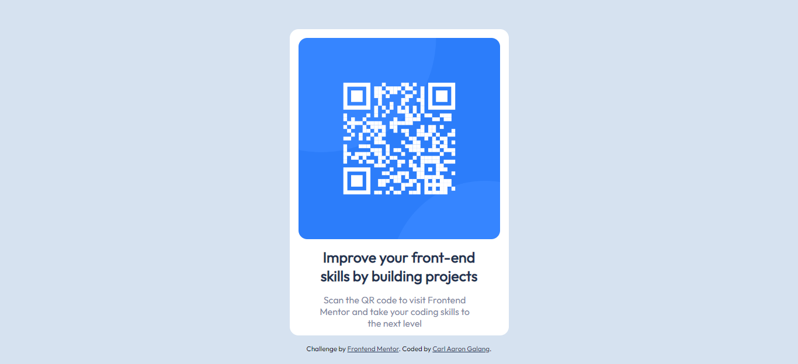

# Frontend Mentor - QR code component solution

This is a solution to the [QR code component challenge on Frontend Mentor](https://www.frontendmentor.io/challenges/qr-code-component-iux_sIO_H). Frontend Mentor challenges help you improve your coding skills by building realistic projects. 

## Table of contents

- [Overview](#overview)
  - [Screenshot](#screenshot)
  - [Links](#links)
- [My process](#my-process)
  - [Built with](#built-with)
  - [What I learned](#what-i-learned)
  - [Continued development](#continued-development)
  - [Useful resources](#useful-resources)
- [Author](#author)
- [Acknowledgments](#acknowledgments)

## Overview

### Screenshot

### Links

- Solution URL: [QR code component using HTML and CSS](https://www.frontendmentor.io/solutions/qr-code-component-using-html-and-css-I4wI4Fpd4s)
- Live Site URL: [GitHub](https://ahahron0304.github.io/QR-code-component/)

## My process

### Built with

- HTML
- CSS

### Useful resources

- [DevDocs](https://devdocs.io/) - This is an amazing article which helped me understand HTML and CSS. I'd recommend it to anyone.

## Author

- Facebook - [Carl Aaron Galang](https://www.facebook.com/CarlAaron.Galang0304//)
- Frontend Mentor - [@ahahron0304](https://www.frontendmentor.io/profile/ahahron0304)
- Twitter - [@_ahahron](https://twitter.com/_ahahron)
